# OKticket Connector

### [Alia Technologies](http://www.alialabs.com/)

---
### [Okticket](https://www.okticket.es/)

--- 
Gestiona tus gastos profesionales desde el móvil , sin tener que conservar tickets y facturas en papel. Utilizarla te resultará de lo más sencillo. Descárgala y úsala. ¡Es gratis!

---

#### Funcionalidades del conector de Odoo con Okticket

+ Sincronizar los **tickets** que hagas desde la app
+ Ver todos tus **gastos**
  - Ver información de un gasto específico
+ Crear **proyectos**
+ Ver detalles del **Centro de coste**
+ Ver detalles de la **Hoja de Gastos**
+ Ver los **usuarios** que se sincronizan directamente en base al mail

---

#### Proceso de creación de un ticket nuevo

Una vez dentro de la app de OKticket podremos ver los tickets introducidos en el mes actual

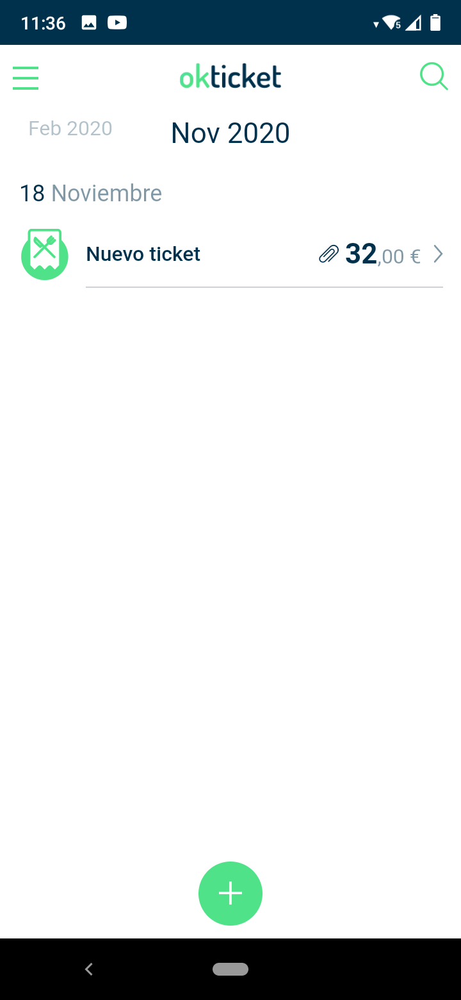

---

Si presionamos en el icono de añadir nos desplegará 3 iconos; el primero para **editar** el ticket a mano, el segundo para **sacar una foto** de un ticket y el tercero para introducir el **kilometraje**.

---

Al sacar la foto del ticket podremos introducir los datos (O si previamente has seleccionado el icono del lápiz)

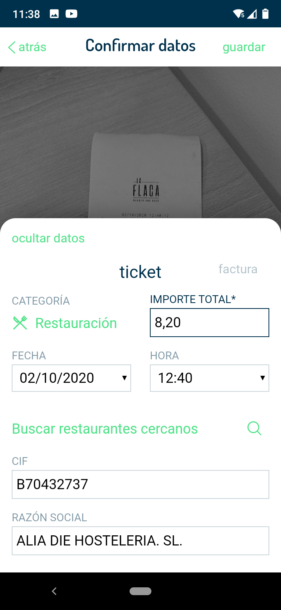

---

Si realizamos scroll vertical, veremos más datos a introducir. Cabe destacar que los campos **Hoja de gasto**, **Centro de gasto**, **Método de pago** y la **Categoría** son proporcionados por el conector de Odoo.

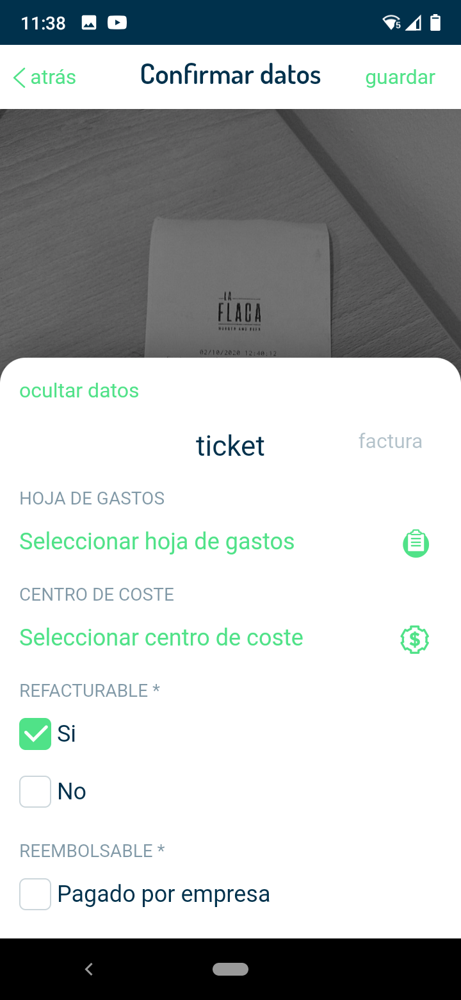

---

Finalmente podremos seleccionar si es *REFACTURABLE* o el *REEMBOLSO* y podremos guardar la información del ticket

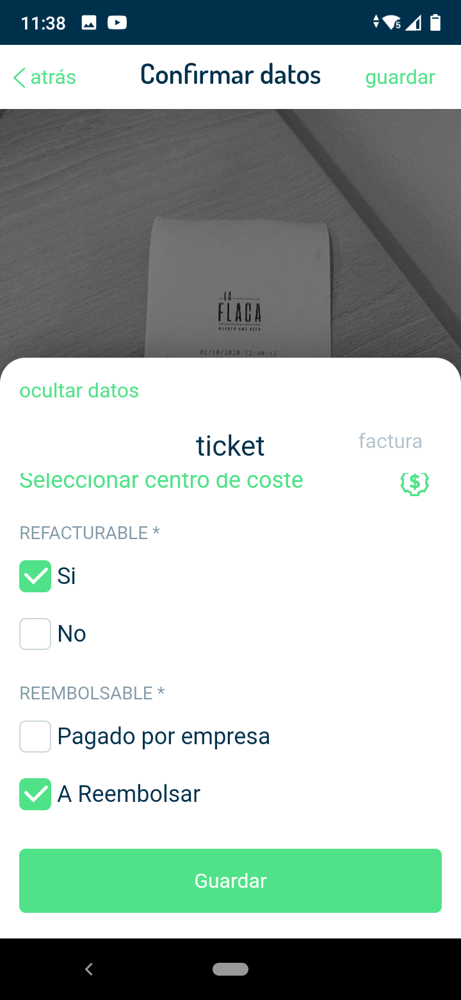

---

#### Proceso de verificación de tickets creados y portal web

Una vez creado el ticket podremos acceder al portal web que nos permite gestionar los datos de los usuarios.

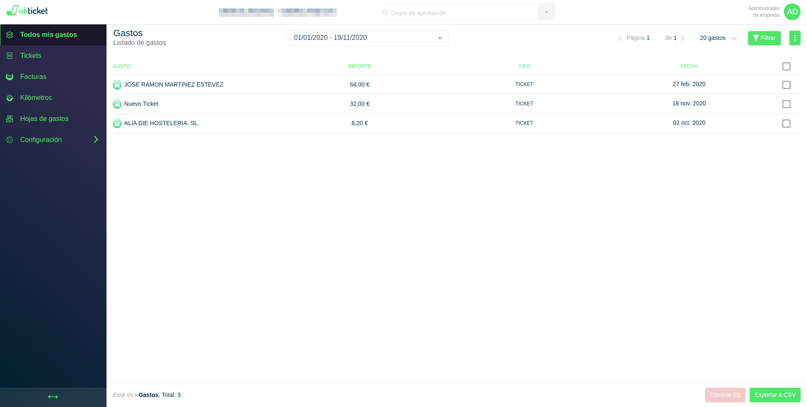

---

En el caso de que no aparezca el ticket que hemos creado recientemente, deberemos sincronizar, utilizando la opción *Sincronizar* del menú lateral de la app

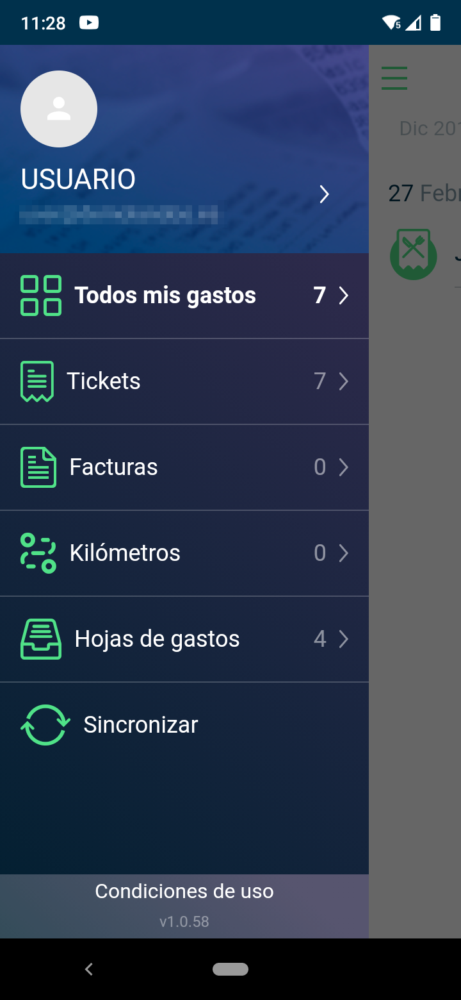

---

#### Visualización de datos en Odoo

En la parte del ERP de Odoo tendremos acceder a la opción del menu *Gastos*

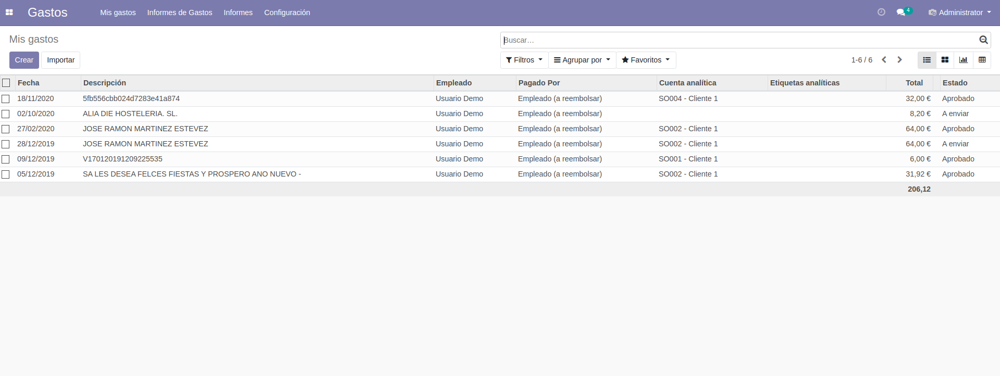

---

También podremos ver los detalles del gasto deseado al pinchar. Esto nos muestra una vista detallada del mismo.

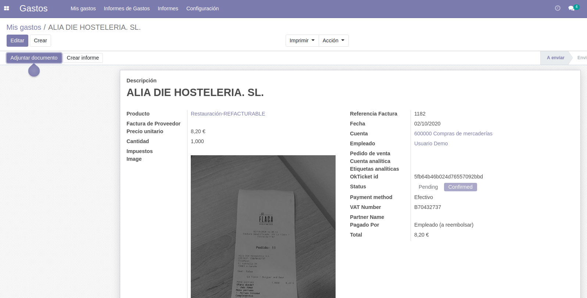

---

#### Uso de los módulos de Odoo

- Crear *Proyecto*

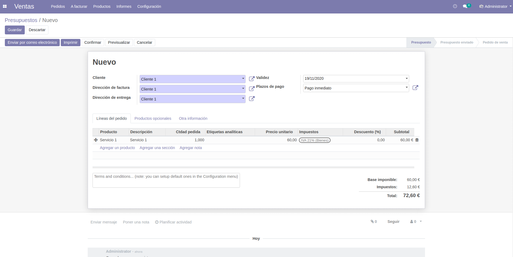

Podremos ver los detalles del mismo

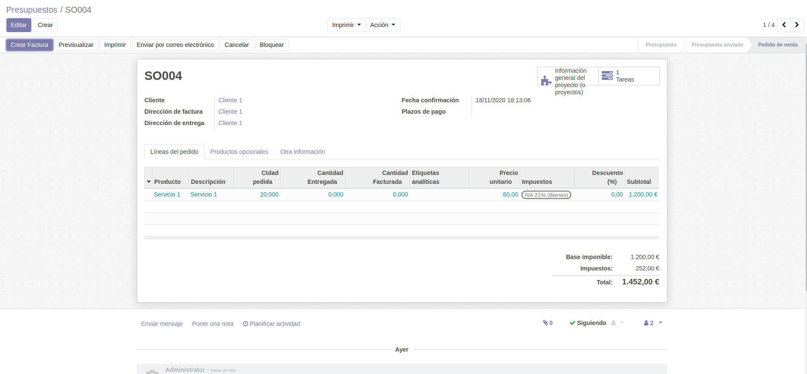

---

- Ver detalles de **Cost Center**: Para ello nos tenderemos que ir al presupuesto indicado y ver la información del proyecto

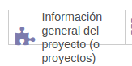

Seguidamente pulsaremos en proyecto

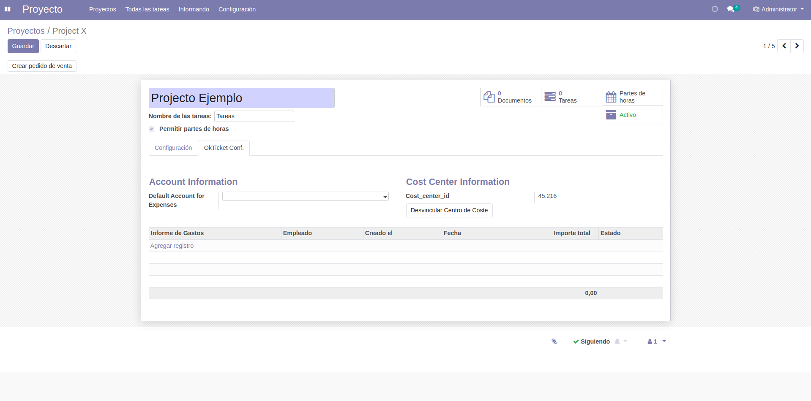

---

También podremos ver información general de un *Presupuesto*, si así lo deseamos

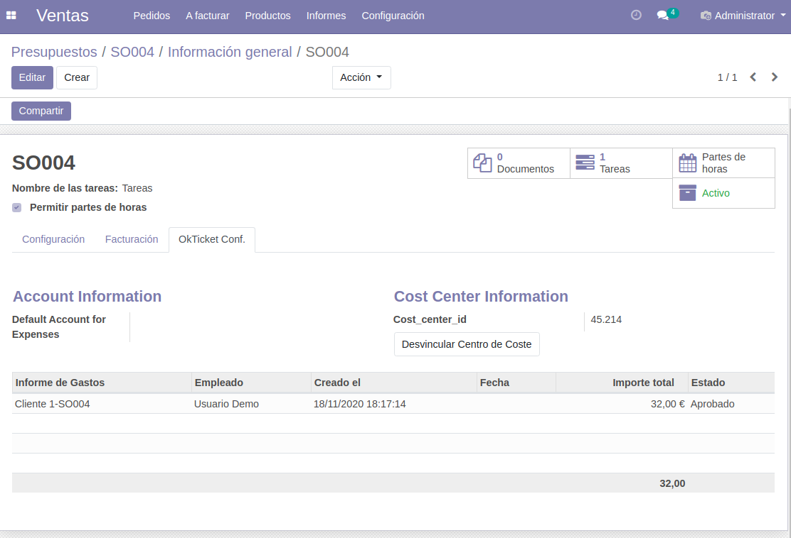

---

- **Hoja de gastos** : Podremos encontrar la información en la vista del cliente

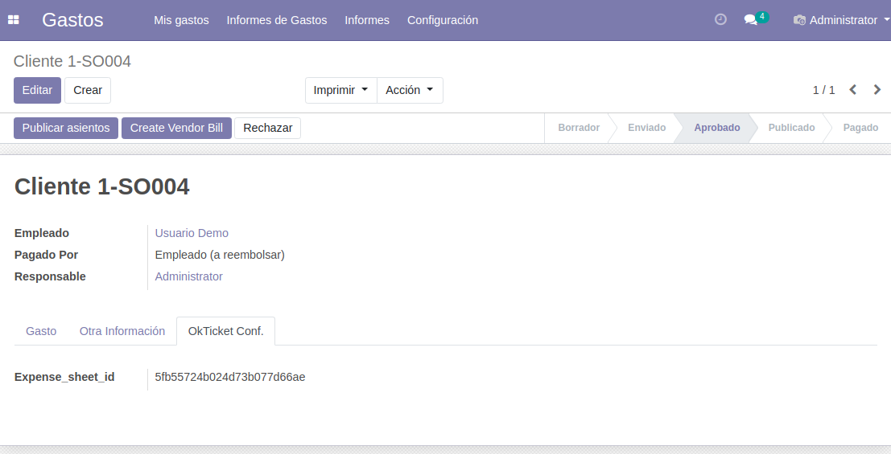

---

- En **Empleados**, sección donde se ecuentra los RRHH  aparecerá el *user_id*, el cual se sincroniza automáticamente en base al mail del cliente.

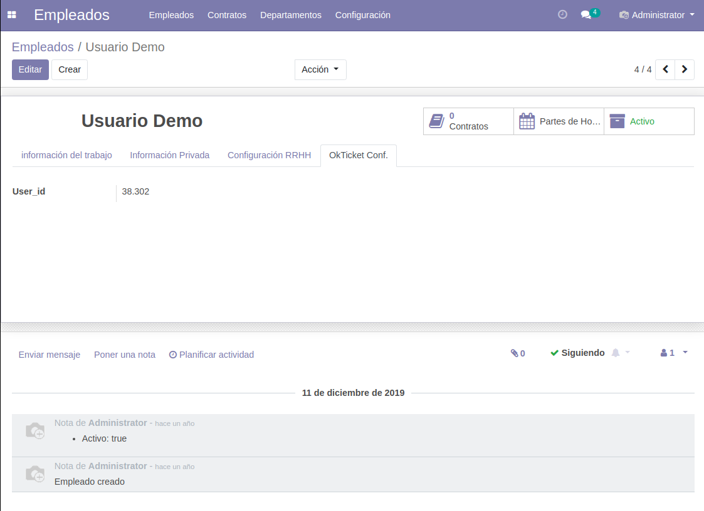

---
### Contacto

Alia Technologies S.L.  
Rúa Nova, Nº8, Ourense  
Phone: 988 319 612 - 698 155 774  
Email: contacto@alialabs.com  
¡Estamos a tu disposición!  

