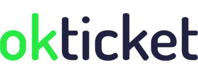
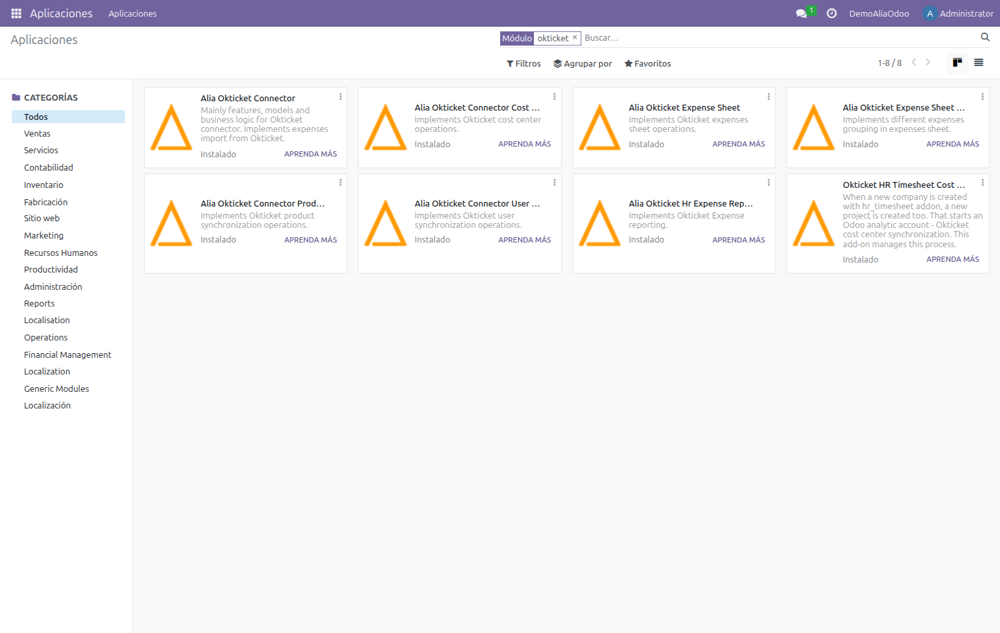
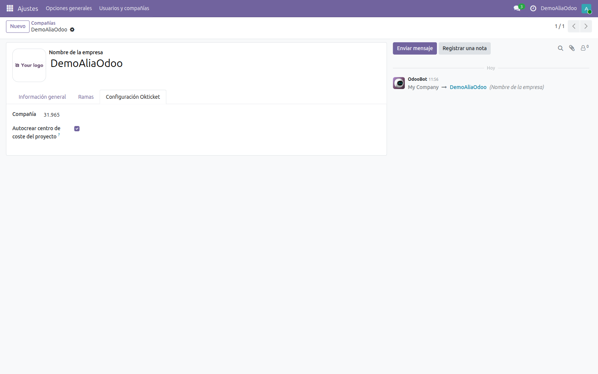
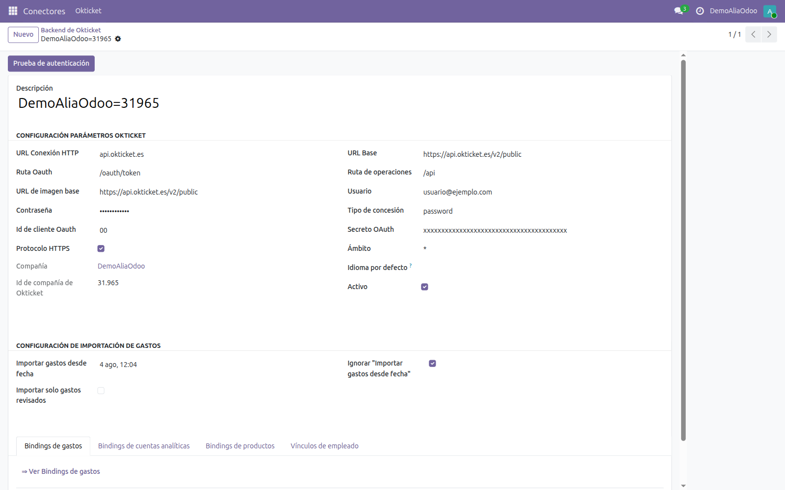
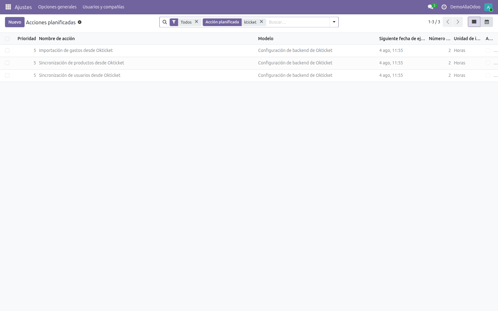
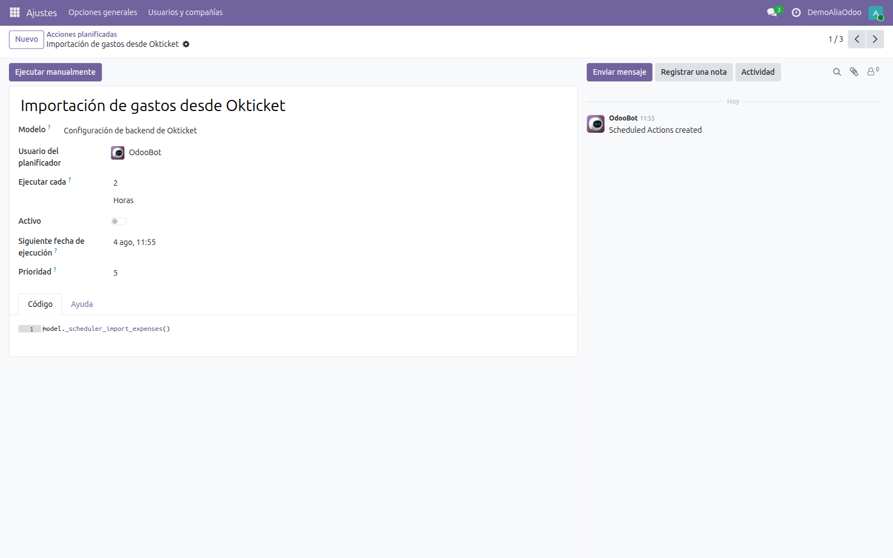
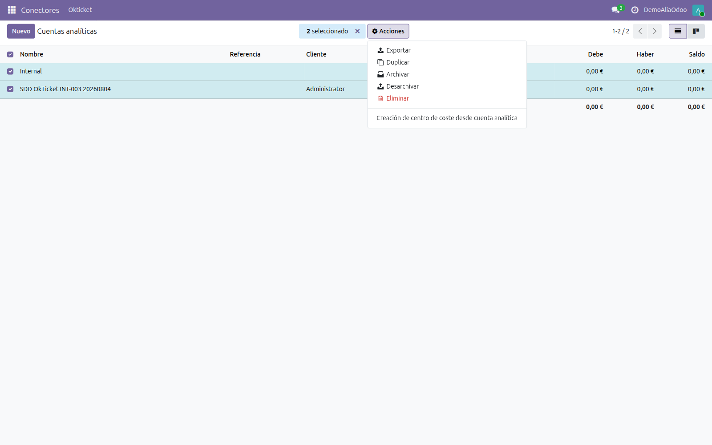
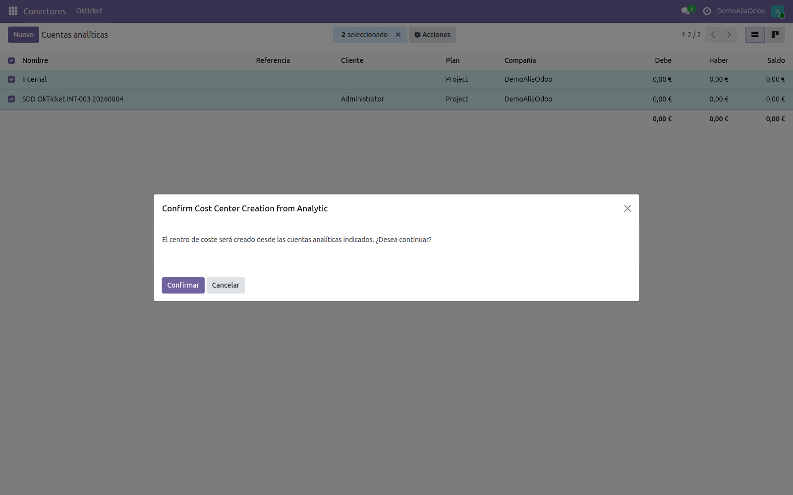
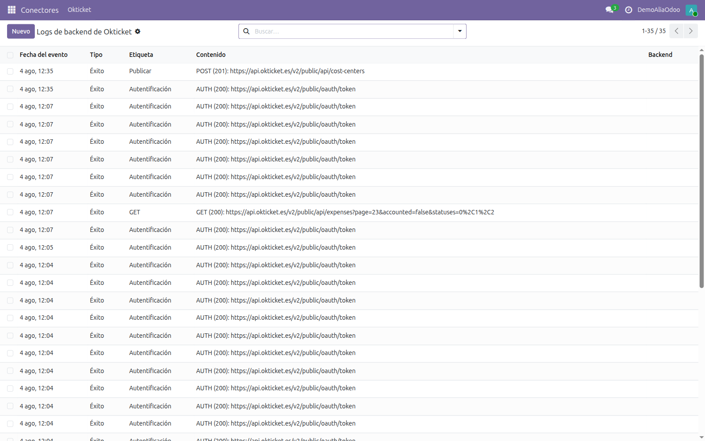

<p align="center">
  
  &nbsp;&nbsp;&nbsp;
  
</p>

<h1 align="center">Conector OkTicket para Odoo 19 · Manual técnico</h1>

<p align="center">
  Instalación, dependencias, configuración del conector y planificación de las sincronizaciones.<br>
  <sub>Módulos <b>19.0.1.0.x</b> · Odoo <b>19.0</b> · Licencia <b>AGPL-3</b> · Rama <code>19.0</code></sub>
</p>

> 📄 **Versión maquetada:** [descargar PDF](https://raw.githubusercontent.com/Alialabs/connector-okticket/19.0/okticket_connector/docs/manual-tecnico.pdf)
> · ¿Buscas el uso diario? [Manual de usuario](manual-usuario.md)

---

## Contenido

1. [Alcance y arquitectura](#1-alcance-y-arquitectura)
2. [Requisitos previos](#2-requisitos-previos)
3. [Clonado del repositorio](#3-clonado-del-repositorio)
4. [Dependencias](#4-dependencias)
5. [Instalación de los módulos](#5-instalación-de-los-módulos)
6. [Grupos y permisos](#6-grupos-y-permisos)
7. [Configuración de la compañía](#7-configuración-de-la-compañía)
8. [Configuración del backend](#8-configuración-del-backend)
9. [Acciones planificadas](#9-acciones-planificadas)
10. [Centros de coste](#10-centros-de-coste)
11. [Multi-compañía](#11-multi-compañía)
12. [Logs y diagnóstico](#12-logs-y-diagnóstico)
13. [Problemas frecuentes](#13-problemas-frecuentes)

---

## 1. Alcance y arquitectura

El conector sincroniza **OkTicket → Odoo** los gastos que los empleados registran desde la
aplicación móvil, junto con sus usuarios y el catálogo de categorías. En sentido inverso,
**Odoo → OkTicket**, publica los centros de coste creados a partir de cuentas analíticas.

Está construido sobre el framework *connector* de la OCA: cada entidad de OkTicket tiene en Odoo
un modelo *binding* que guarda la correspondencia entre el registro local y su identificador remoto.

| Módulo | Qué aporta | Binding |
|---|---|---|
| `okticket_connector` | Base del conector: backend, cliente HTTP, log de eventos e importación de gastos. | `okticket.hr.expense` |
| `okticket_connector_user_synchronization` | Importa los usuarios de OkTicket y los empareja con empleados por correo electrónico. | `okticket.hr.employee` |
| `okticket_connector_product_synchronization` | Importa el árbol de categorías de OkTicket como productos de gasto. | `okticket.product.template` |
| `okticket_connector_cost_center` | Publica cuentas analíticas de Odoo como centros de coste en OkTicket. | `okticket.account.analytic.account` |
| `okticket_hr_timesheet_cost_center` | Evita que el proyecto que Odoo crea automáticamente con cada compañía dispare una sincronización espuria. Opcional. | — |

> [!IMPORTANT]
> En Odoo 19 **no existen las hojas de gasto** (`hr.expense.sheet` fue eliminado junto con el flujo
> de gastos basado en hojas). Los módulos que dependían de ese modelo
> (`okticket_connector_hr_expense_sheet`, `…_grouping` y `okticket_hr_expense_reporting`)
> **no forman parte de esta versión**. Los gastos importados quedan como gastos individuales en
> estado *Borrador*.

---

## 2. Requisitos previos

- Una instancia de **Odoo 19.0** (Community o Enterprise) sobre PostgreSQL.
- Acceso al sistema de ficheros de *addons* y capacidad de reiniciar el servicio.
- **Credenciales de la API de OkTicket**: usuario, contraseña, *OAuth client id* y *OAuth secret*,
  más el **identificador numérico de la compañía**. Los facilita OkTicket y son distintos para cada cliente.
- **Salida HTTPS** desde el servidor de Odoo hacia `api.okticket.es` (o `apipre.okticket.es` en
  preproducción). Si Odoo corre tras un proxy con lista blanca, hay que autorizar ese host.

### Entorno contable

OkTicket es un producto español y devuelve los tipos de IVA españoles. Conviene que la compañía
tenga instalada la localización española (`l10n_es`) con su plan contable aplicado, y que existan
los impuestos de compra al **0 %, 4 %, 10 % y 21 %**, además de un diario de compras. Sin ellos,
los gastos importados recaen siempre en el impuesto por defecto del producto.

---

## 3. Clonado del repositorio

El repositorio mantiene una rama por versión de Odoo. Para 19.0:

```bash
git clone --branch 19.0 https://github.com/Alialabs/connector-okticket.git
```

---

## 4. Dependencias

### Módulos OCA

Ambos repositorios en su rama `19.0`:

| Repositorio | Módulos que aporta |
|---|---|
| `OCA/connector` | `connector`, `component`, `component_event` |
| `OCA/queue` | `queue_job` |

### Módulos estándar de Odoo

`hr`, `hr_expense`, `hr_timesheet`, `sale_expense`, `product`, `uom`, `analytic` y, para el módulo
de centros de coste, `project`.

### Dependencias Python

Una sola, declarada en `requirements.txt`: `cachetools==3.1.1`.

> [!NOTE]
> En despliegues Docker/Doodba va en `odoo/custom/dependencies/pip.txt`, no instalada en caliente
> dentro del contenedor.

---

## 5. Instalación de los módulos

Con las rutas ya en `addons_path` y el servicio reiniciado, los módulos aparecen buscando
**okticket** en la lista de aplicaciones.

> [!NOTE]
> Ninguno de los módulos declara `application: True`, así que hay que **quitar el filtro
> «Aplicaciones»** del buscador para que aparezcan.



Qué instalar según el alcance:

- `okticket_connector` — obligatorio.
- `okticket_connector_user_synchronization` y `okticket_connector_product_synchronization` —
  necesarios para que la importación de gastos encuentre empleado y producto.
- `okticket_connector_cost_center` — solo si vas a publicar centros de coste.

```bash
odoo -d <base_de_datos> --stop-after-init \
  -i okticket_connector,okticket_connector_user_synchronization,\
okticket_connector_product_synchronization,okticket_connector_cost_center
```

> [!WARNING]
> La importación de gastos necesita que **usuarios y productos ya estén sincronizados**. Un gasto
> cuyo empleado o producto no se resuelva se descarta silenciosamente. Ejecuta siempre en el orden
> **Usuarios → Productos → Gastos**.

---

## 6. Grupos y permisos

El conector define dos grupos, y **los parámetros de conexión del backend solo son visibles para
quien pertenece a ellos**. Un administrador recién creado no los ve.

| Grupo | Referencia | Permite |
|---|---|---|
| OkTicket / User | `okticket_connector.group_okticket_conn_user` | Ver el menú OkTicket, los backends, los logs y los *bindings*, y lanzar la prueba de autenticación. |
| OkTicket / Manager | `okticket_connector.group_okticket_conn_manager` | Además, crear y modificar backends. |

Asigna el grupo desde *Ajustes → Usuarios y compañías → Usuarios*. Si acabas de cambiar los grupos
y la ficha del backend sigue apareciendo incompleta, **cierra y reabre la sesión**: el cliente web
cachea la definición de las vistas.

---

## 7. Configuración de la compañía

Cada compañía de Odoo que vaya a sincronizar necesita su identificador de OkTicket. En
*Ajustes → Usuarios y compañías → Compañías*, abre la compañía y ve a la pestaña
**Configuración Okticket**.



| Campo | Descripción |
|---|---|
| **Compañía** | Identificador numérico que facilita OkTicket. **Sin él la importación descarta todos los gastos**, porque no puede resolver a qué compañía pertenecen. |
| **Autocrear centro de coste del proyecto** | Si está activo, al crear un proyecto en Odoo se publica automáticamente su cuenta analítica como centro de coste en OkTicket. |

---

## 8. Configuración del backend

El *backend* guarda los datos de conexión con la API. Hay **uno por compañía**. Se crea desde
*Conectores → Okticket → Backend de Okticket*.



### Parámetros de conexión

| Campo | Valor de producción | Comentario |
|---|---|---|
| URL Conexión HTTP | `api.okticket.es` | Solo el host. |
| URL Base | `https://api.okticket.es/v2/public` | |
| URL de imagen base | `https://api.okticket.es/v2/public` | Descarga de tickets y PDF. |
| Ruta Oauth | `/oauth/token` | |
| Ruta de operaciones | `/api` | |
| Tipo de concesión | `password` | |
| Ámbito | `*` | |
| Protocolo HTTPS | Activado | |
| Usuario / Contraseña | — | Credenciales del cliente. Las facilita OkTicket. |
| Oauth client id / Secreto OAuth | — | Credenciales del cliente. Las facilita OkTicket. |

Los parámetros técnicos vienen rellenos por defecto al crear un backend nuevo: en la práctica solo
hay que introducir las cuatro credenciales y asignar la compañía. Para apuntar a preproducción,
sustituye `api.okticket.es` por `apipre.okticket.es` en los cuatro valores de URL.

### Parámetros de importación

| Campo | Efecto |
|---|---|
| **Importar gastos desde fecha** | Marca de la última importación. El conector la actualiza solo y pide a la API únicamente lo modificado después. |
| **Ignorar «Importar gastos desde fecha»** | Desactiva el filtro incremental y reimporta el conjunto completo. Útil en la primera carga o para rehacer una importación. |
| **Importar solo gastos revisados** | Restringe la importación a los gastos marcados como revisados en OkTicket. |

### Prueba de autenticación

El botón **Prueba de autenticación** pide un token a la API con las credenciales guardadas. Si todo
es correcto aparece una notificación verde de conexión correcta. Si falla, revisa usuario,
contraseña, *client id*, secreto y la conectividad de salida hacia el host.

---

## 9. Acciones planificadas

El conector instala tres acciones planificadas, todas sobre el modelo `okticket.backend` y con un
intervalo por defecto de **2 horas**.

> [!WARNING]
> Los tres crons se instalan **desactivados** a propósito, para que una instalación nueva no empiece
> a sincronizar antes de estar configurada. Hay que activarlos explícitamente cuando la prueba de
> autenticación funcione.



| Orden | Acción | Método |
|---|---|---|
| 1 | User Synchronization From Okticket | `_scheduler_import_employee()` |
| 2 | Product Synchronization From Okticket | `_scheduler_synchronize_products()` |
| 3 | Import Expenses From Okticket | `_scheduler_import_expenses()` |



Para la primera carga, ejecuta las tres manualmente en ese orden con *Ejecutar manualmente*. La
importación de gastos recorre la API paginada y confirma al final, de modo que **consultar la tabla
a mitad del proceso devuelve cero legítimamente**: espera a que termine antes de dar nada por fallido.

---

## 10. Centros de coste

Es la única sincronización que va de **Odoo hacia OkTicket**, y la aporta el módulo
`okticket_connector_cost_center`. Lo que se publica es una **cuenta analítica**
(`account.analytic.account`), no un proyecto: el proyecto solo interviene como disparador de la
variante automática.

### Publicación manual desde la lista de cuentas analíticas

El módulo registra un `ir.actions.server` anclado a la **vista lista** de
`account.analytic.account` (`binding_view_types=list`). Aparece en el menú **Acciones** al
seleccionar uno o varios registros.



La acción abre el asistente `analytic.cost.center.wizard`, que confirma antes de escribir en OkTicket.



Su comportamiento:

- Ignora las cuentas que **ya tienen binding** (`okticket_bind_ids`), de modo que relanzar la acción
  es idempotente.
- Antes de crear comprueba si en OkTicket existe ya un centro de coste con el mismo nombre. Si lo
  hay, pide una **confirmación explícita de duplicado**.
- Si el conflicto surge con **varias cuentas seleccionadas**, aborta con un `ValidationError` y
  obliga a procesarlas de una en una.

### Publicación automática desde proyectos

Con *Autocrear centro de coste del proyecto* activo en la compañía, un *listener* sobre
`project.project` llama a `_okticket_create()` sobre la cuenta analítica del proyecto en cuanto
este se crea. Renombrar el proyecto propaga el nuevo nombre; archivarlo desactiva el centro de
coste, y borrarlo lo elimina en OkTicket.

> [!NOTE]
> El módulo opcional `okticket_hr_timesheet_cost_center` existe precisamente para que el proyecto
> que Odoo crea de oficio al dar de alta una compañía con `hr_timesheet` no dispare esta publicación.

---

## 11. Multi-compañía

El conector soporta varias compañías simultáneamente. El esquema es:

- Un **backend por compañía**, cada uno con su propio identificador de OkTicket.
- Las mismas credenciales pueden servir para varias compañías: la API las distingue por la
  cabecera `company`.
- Los gastos, empleados e impuestos se resuelven **dentro de la compañía del backend**, de modo que
  no se mezclan entre sí.

Los productos, en cambio, son compartidos: si dos compañías de OkTicket exponen el mismo árbol de
categorías, ambas apuntarán a las mismas plantillas de producto en Odoo.

---

## 12. Logs y diagnóstico

Cada llamada a la API queda registrada en *Conectores → Okticket → Logs*, con su tipo (*Éxito*,
*Aviso*, *Error*), la etiqueta de la operación y la URL con el código de respuesta.



Es el primer sitio donde mirar cuando una sincronización no produce lo esperado. Una importación
sana no deja ninguna entrada de tipo *Error*.

---

## 13. Problemas frecuentes

| Síntoma | Causa habitual | Solución |
|---|---|---|
| La ficha del backend no muestra los parámetros de conexión. | El usuario no pertenece a los grupos del conector, o la sesión tiene la vista cacheada. | Asignar el grupo *OkTicket / Manager* y volver a iniciar sesión. |
| La importación termina sin errores pero no aparece ningún gasto. | Falta el identificador de compañía, o no se han sincronizado antes usuarios y productos. | Rellenar *Compañía* en la pestaña OkTicket y ejecutar los crons en orden. |
| La prueba de autenticación falla. | Credenciales incorrectas o salida HTTPS bloqueada. | Verificar las cuatro credenciales y el acceso a `api.okticket.es` desde el servidor. |
| Los gastos entran con un impuesto que no corresponde. | La compañía no tiene el plan contable español con los tipos 0/4/10/21 de compra. | Instalar `l10n_es` y aplicar el plan a la compañía. |
| Solo se importa la primera página de gastos. | Corte de conectividad durante el recorrido paginado. | Revisar los logs y relanzar la importación. |
| Se repite la importación completa en cada ejecución. | *Ignorar «Importar gastos desde fecha»* está activo. | Desactivarlo una vez hecha la carga inicial. |

---

<p align="center">
  <b>Alia Technologies S.L.</b><br>
  Rúa Nova 8, Ourense · 988 319 612<br>
  <a href="mailto:contacto@alialabs.com">contacto@alialabs.com</a> ·
  <a href="https://www.alialabs.com">alialabs.com</a><br>
  <sub>Conector OkTicket para Odoo 19 · Licencia AGPL-3</sub>
</p>
