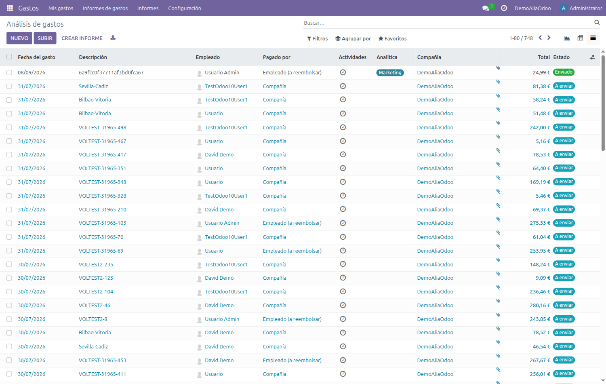
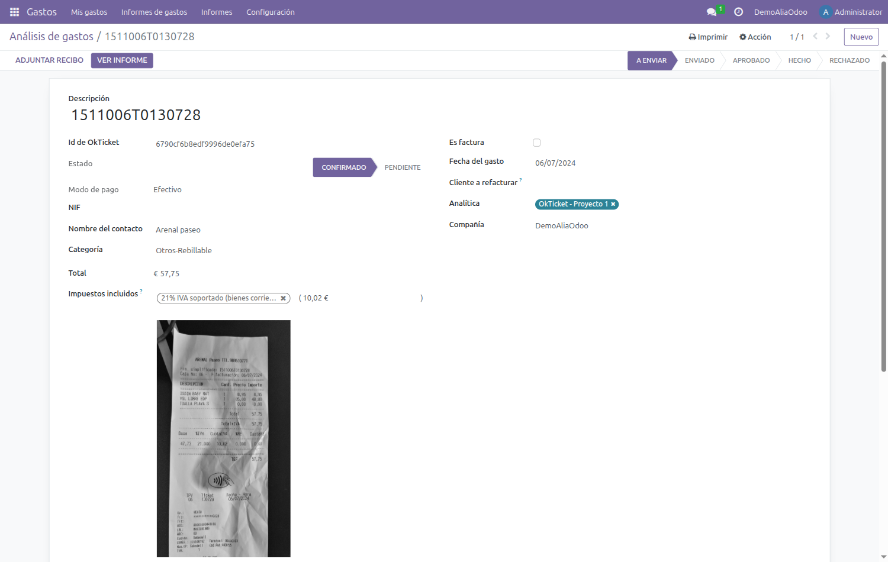
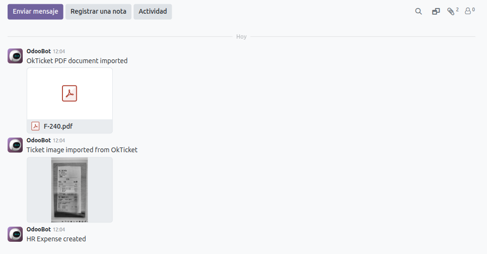
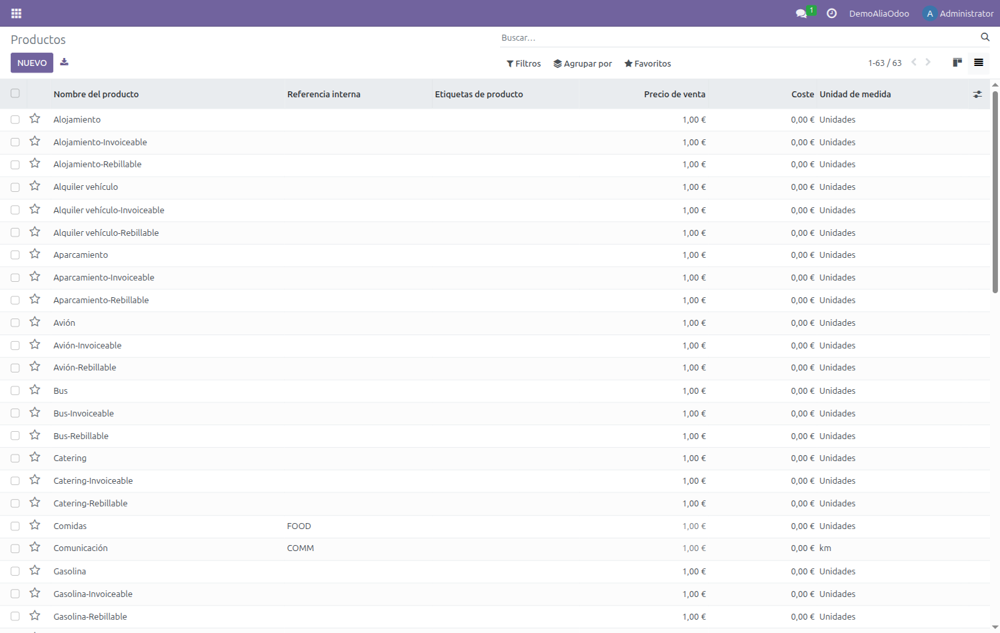
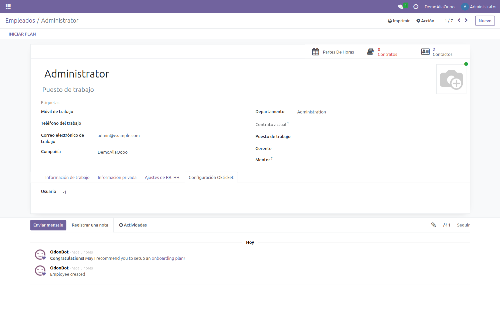
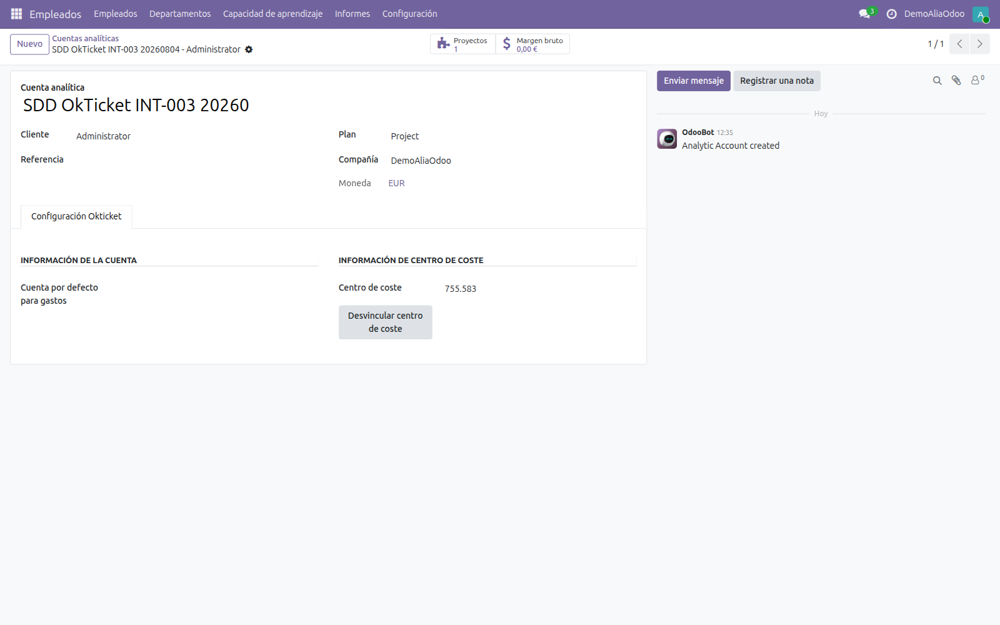

  
  &nbsp;&nbsp;&nbsp;
  

<h1 align="center">Conector OkTicket para Odoo 19 · Manual de usuario</h1>

  Qué hace el conector en tu día a día y dónde encontrar cada cosa en Odoo. 
  Para usuarios de Odoo <b>19.0</b> · No requiere conocimientos técnicos

> 📄 **Versión maquetada:** [descargar PDF](https://raw.githubusercontent.com/Alialabs/connector-okticket/19.0/okticket_connector/docs/manual-usuario.pdf)
> · ¿Necesitas instalarlo o configurarlo? [Manual técnico](manual-tecnico.md)

---

## Contenido

1. [Qué hace el conector](#1-qué-hace-el-conector)
2. [El circuito de un ticket](#2-el-circuito-de-un-ticket)
3. [Consultar los gastos importados](#3-consultar-los-gastos-importados)
4. [La ficha de un gasto](#4-la-ficha-de-un-gasto)
5. [Imagen del ticket y facturas PDF](#5-imagen-del-ticket-y-facturas-pdf)
6. [Categorías y productos](#6-categorías-y-productos)
7. [Empleados y usuarios](#7-empleados-y-usuarios)
8. [Cuentas analíticas y centros de coste](#8-cuentas-analíticas-y-centros-de-coste)
9. [Qué hacer con un gasto importado](#9-qué-hacer-con-un-gasto-importado)
10. [Dudas frecuentes](#10-dudas-frecuentes)

---

## 1. Qué hace el conector

El conector trae a Odoo, de forma automática, los gastos que registras con la aplicación de
OkTicket. No tienes que introducir nada a mano: fotografías el ticket con el móvil y, en la
siguiente sincronización, el gasto aparece en Odoo con su importe, su fecha, su categoría, tu
nombre como empleado y la imagen del recibo adjunta.

Además mantiene alineados los catálogos entre ambos sistemas:

- Los **usuarios** de OkTicket se emparejan con los empleados de Odoo por correo electrónico.
- Las **categorías** de gasto de OkTicket se crean en Odoo como productos.
- Las **cuentas analíticas** de Odoo se publican en OkTicket como centros de coste, para que puedas
  imputar un ticket a un proyecto desde el móvil.

> [!NOTE]
> La sincronización es **programada**, normalmente cada dos horas. Si acabas de subir un ticket y
> todavía no lo ves en Odoo, lo más probable es que aún no haya pasado la siguiente ejecución.

---

## 2. El circuito de un ticket

| | Paso | Qué ocurre |
|---|---|---|
| **1** | Móvil | Fotografías el ticket en la app de OkTicket y completas los datos. |
| **2** | OkTicket | El ticket queda registrado y, si procede, revisado. |
| **3** | Sincronización | Odoo consulta la API y trae los gastos nuevos o modificados. |
| **4** | Odoo | Aparece un gasto en estado *Borrador*, listo para tramitar. |

---

## 3. Consultar los gastos importados

Los gastos viven en la aplicación **Gastos** de Odoo. Cada empleado ve los suyos en *Mis gastos*;
quien tenga permisos de responsable o de contabilidad puede ver los de toda la compañía.

> [!TIP]
> Los gastos importados llegan en estado **Borrador**. Algunas vistas de Odoo traen por defecto un
> filtro que solo muestra los gastos ya tramitados: si la lista te aparece vacía, **quita el filtro**
> del buscador y volverán a salir.

La columna **Descripción** muestra la referencia del ticket en OkTicket, lo que facilita localizar
un gasto concreto si te lo reclaman por su número.

---

## 4. La ficha de un gasto

Al abrir un gasto verás los campos habituales de Odoo —categoría, importe, impuestos, empleado,
quién lo paga— y, además, una pestaña **Servidor Okticket** que añade el conector.

| Campo | Qué significa |
|---|---|
| **Id de Okticket** | Identificador del gasto en OkTicket. Es la referencia que hay que dar al soporte si algo no cuadra. |
| **Estado** | Estado del gasto en OkTicket (por ejemplo *Confirmado*). Es informativo: no cambia el estado del gasto en Odoo. |
| **Es factura** | Marcado cuando el documento es una factura y no un simple ticket. |
| **Modo de pago** | Cómo se pagó según la app: tarjeta, efectivo, etc. |
| **NIF** y **Nombre del contacto** | Datos del establecimiento leídos del recibo, cuando la app ha podido extraerlos. |
| **Hoja de Gastos** | Texto descriptivo del informe al que pertenece el gasto en OkTicket. Es solo información. |

> [!NOTE]
> En Odoo 19 ya **no se utilizan hojas de gasto**: cada gasto se tramita individualmente. El campo
> *Hoja de Gastos* refleja únicamente cómo estaba agrupado en OkTicket.

---

## 5. Imagen del ticket y facturas PDF

El conector adjunta al gasto la **fotografía del recibo**, que puedes ver directamente en el panel
derecho de la ficha. Cuando el documento es una factura enviada al robot de OkTicket, adjunta
también el **PDF original**.

Ambos quedan registrados en el historial con un mensaje del sistema, de modo que siempre se sabe
qué llegó y cuándo. Los documentos no se duplican: si la sincronización vuelve a pasar sobre el
mismo gasto, no se adjuntan de nuevo.

---

## 6. Categorías y productos

Cada categoría de OkTicket —Restauración, Peaje, Aparcamiento, Kilómetros…— tiene su equivalente en
Odoo como producto de gasto. Es lo que hace que, al importar, el gasto quede clasificado
automáticamente.

Verás que algunas categorías aparecen duplicadas con el sufijo **-Invoiceable**. Son la variante que
se usa cuando el documento es una factura, y permiten distinguir contablemente un ticket de una
factura del mismo concepto.

> [!IMPORTANT]
> Estos productos los crea y mantiene el conector. **No los borres ni los renombres**: si desaparece
> el producto de una categoría, los gastos de esa categoría dejarán de importarse.

---

## 7. Empleados y usuarios

El emparejamiento entre un usuario de OkTicket y un empleado de Odoo se hace por **correo
electrónico**. En la ficha del empleado, la pestaña **Configuración Okticket** muestra el
identificador con el que quedó vinculado.

> [!WARNING]
> Si el correo del empleado en Odoo no coincide con el de su cuenta de OkTicket, **sus gastos no se
> importarán**. Es la causa más habitual de que a una persona concreta no le lleguen los tickets.
> Revisa que el correo de trabajo sea exactamente el mismo.

---

## 8. Cuentas analíticas y centros de coste

Lo que se publica en OkTicket como **centro de coste** es una **cuenta analítica** de Odoo. Una vez
publicada, al registrar un ticket desde el móvil puedes imputarlo a ese centro de coste.

### Publicar cuentas analíticas a mano

Es la forma habitual y funciona con cualquier cuenta analítica, tenga o no un proyecto detrás. Ve a
la lista de **cuentas analíticas**, marca las que quieras publicar y despliega el menú **Acciones**:
encontrarás **Creación de centro de coste desde cuenta analítica**.

Odoo pide confirmación antes de crear nada:

> [!NOTE]
> **Duplicados.** Si en OkTicket ya existe un centro de coste con ese nombre, el asistente avisa y
> pide una confirmación adicional antes de crear el duplicado. Cuando el conflicto afecta a una
> selección múltiple, hay que procesar las cuentas **de una en una**. Las cuentas que ya estén
> vinculadas se ignoran, así que repetir la acción es inofensivo.

### Publicación automática desde proyectos

Además, si tu compañía tiene activada la opción *Autocrear centro de coste del proyecto*, al dar de
alta un **proyecto** en Odoo su cuenta analítica se publica sola, sin pasar por la acción anterior.

### Comprobar el vínculo

La pestaña **Configuración Okticket** de la cuenta analítica indica el identificador del centro de
coste y ofrece la opción de **desvincularlo** si se quiere dejar de sincronizar.

---

## 9. Qué hacer con un gasto importado

El conector **solo trae el gasto**: no lo aprueba ni lo contabiliza. A partir de ahí sigue el
circuito normal de gastos de Odoo.

1. Revisa que el importe, la fecha y la categoría se correspondan con el recibo adjunto.
2. Comprueba quién paga: *Empleado (a reembolsar)* o *Compañía*.
3. Si procede, asigna la distribución analítica al proyecto correspondiente.
4. Envía el gasto para su aprobación con el botón **Enviar**.

El estado avanza por `Borrador` → `Aprobado` → `Registrado` → `Pagado`, igual que cualquier otro
gasto de Odoo.

> [!NOTE]
> Los cambios que hagas en Odoo **no vuelven a OkTicket**. Si un gasto está mal en origen, corrígelo
> en la aplicación de OkTicket y espera a la siguiente sincronización.

---

## 10. Dudas frecuentes

| Situación | Qué ocurre y qué hacer |
|---|---|
| He subido un ticket y no aparece en Odoo. | La sincronización se ejecuta cada dos horas. Si tras la siguiente pasada sigue sin aparecer, comprueba que tu correo en Odoo coincide con el de OkTicket y avisa al administrador. |
| La lista de gastos me sale vacía. | Suele ser el filtro por defecto de la vista, que oculta los borradores. Quítalo desde el buscador. |
| El importe del gasto no coincide con el del ticket. | El conector importa el total que se registró en OkTicket. Corrige el importe en la app y espera a la siguiente sincronización. |
| Falta la imagen del recibo. | Ocurre si el ticket se creó a mano en OkTicket, sin fotografía. Puedes adjuntarla en Odoo con *Adjuntar recibo*. |
| Un gasto aparece con la categoría equivocada. | Se hereda de la categoría elegida en la app. Puedes cambiarla en Odoo; el cambio no se propaga a OkTicket. |
| He borrado un gasto en OkTicket y sigue en Odoo. | El borrado no se propaga. Elimina también el gasto en Odoo si aún está en borrador. |
| No veo el menú de OkTicket en Odoo. | Ese menú es para administradores. Como usuario no lo necesitas: tus gastos están en la aplicación *Gastos*. |

---

  <b>Alia Technologies S.L.</b> 
  Rúa Nova 8, Ourense · 988 319 612 
  <a href="mailto:contacto@alialabs.com">contacto@alialabs.com</a> ·
  <a href="https://www.alialabs.com">alialabs.com</a> 
  Conector OkTicket para Odoo 19 · Licencia AGPL-3

